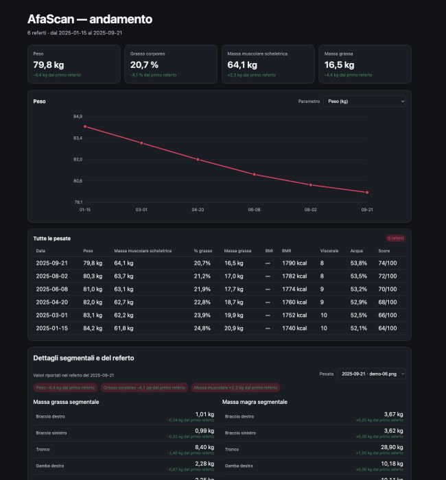

# AfaScan tools

[](https://github.com/alsd4git/afascan-tools/actions/workflows/ci.yml)
[](https://www.python.org/)
[](https://docs.astral.sh/uv/)
[](LICENSE)

Strumenti locali per trasformare gli screenshot dei referti AfaScan in dati strutturati, esportazioni tabellari e una dashboard HTML offline.



*La preview usa esclusivamente dati demo sintetici e non contiene referti personali.*

## Cosa fa

- importa gli screenshot con OCR tramite Tesseract;
- conserva il testo OCR originale per il controllo e la correzione;
- normalizza i dati in JSON e CSV;
- genera una dashboard statica con grafico storico, tabella delle pesate e dettagli segmentali;
- mostra le variazioni dal primo referto, inclusi massa grassa e massa magra dei singoli segmenti;
- applica correzioni esplicite tramite `data/overrides.json`;
- valida tipi, date, intervalli, segmenti e identificatori prima di scrivere gli output;
- evita di rieseguire l’OCR sui file già importati, salvo richiesta esplicita.

Il progetto organizza le misure riportate dallo strumento e non fornisce interpretazioni o indicazioni mediche.

## Avvio rapido

### 1. Installa i prerequisiti

Sono necessari [uv](https://docs.astral.sh/uv/) e [Tesseract OCR](https://github.com/tesseract-ocr/tesseract).

| Sistema | uv | Tesseract |
| --- | --- | --- |
| macOS | `brew install uv` | `brew install tesseract` |
| Debian/Ubuntu | [Script ufficiale](https://docs.astral.sh/uv/getting-started/installation/) | `sudo apt install tesseract-ocr` |
| Windows PowerShell | `winget install --id=astral-sh.uv -e` | [Installer UB Mannheim](https://github.com/UB-Mannheim/tesseract/wiki) |

Su Debian/Ubuntu puoi usare anche questo comando per installare uv:

```bash
curl -LsSf https://astral.sh/uv/install.sh | sh
```

Su Windows, durante l’installazione di Tesseract includi la lingua inglese e aggiungi `C:\Program Files\Tesseract-OCR` al `PATH`; poi riavvia PowerShell.

`uv` crea e gestisce automaticamente l’ambiente Python del progetto: non serve attivare manualmente un virtual environment.

### 2. Importa gli screenshot

Copia i PNG nella cartella `screenshots/`, preferibilmente con nomi come `Screenshot_YYYYMMDD-HHMMSS.png`, poi esegui:

```bash
uv run parse_scans.py
```

Alla prima esecuzione vengono importati gli screenshot presenti; nelle esecuzioni successive vengono processati solo quelli nuovi.

### 3. Apri la dashboard

Apri `dashboard.html` con un doppio click, oppure usa il comando del tuo sistema:

```bash
# macOS
open dashboard.html

# Linux
xdg-open dashboard.html

# Windows PowerShell
Start-Process .\dashboard.html
```

Non è necessario avviare un server web: la dashboard è un file HTML statico autosufficiente.

## Comandi

| Comando | Uso |
| --- | --- |
| `uv run parse_scans.py` | Importa i nuovi screenshot ed esegue OCR solo quando serve. |
| `uv run parse_scans.py --no-ocr` | Rigenera JSON, CSV e dashboard senza eseguire Tesseract. |
| `uv run parse_scans.py --force-ocr` | Riesegue intenzionalmente l’OCR su tutti gli screenshot presenti. |
| `uv run parse_scans.py --help` | Mostra le opzioni disponibili. |

`--no-ocr` e `--force-ocr` sono alternativi.

## Correggere un risultato OCR

`data/measurements.json` è un output generato: non modificarlo direttamente. Inserisci invece le correzioni in `data/overrides.json`, usando il nome dello screenshot come chiave:

```json
{
  "Screenshot_20260101-120000.png": {
    "weight_kg": 80.4,
    "body_fat_percent": 21.7
  }
}
```

Poi rilancia `uv run parse_scans.py` oppure `uv run parse_scans.py --no-ocr`. Il parser ricostruisce la base dal testo in `data/ocr/` e riapplica gli override, rendendo reversibili le correzioni quando il testo OCR originale è disponibile.

Le chiavi degli override devono corrispondere a uno screenshot presente o a un referto archiviato; un nome inesistente viene segnalato come errore.

## Personalizzare la dashboard

- modifica `dashboard.template.html` per cambiare layout, colori, tabelle o grafici;
- non modificare direttamente `dashboard.html`, perché è un artefatto generato;
- dopo le modifiche esegui `uv run parse_scans.py --no-ocr` per rigenerare l’HTML.

Il JSON viene incorporato nell’HTML in un blocco dati separato; non sono richiesti database, rete o servizi esterni.

## Sviluppo e verifiche

```bash
uv sync --dev
uv run ruff check .
uv run pytest -q
uv run python -m compileall -q parse_scans.py tests
node tests/dashboard_smoke.mjs dashboard.html empty
node tests/dashboard_smoke.mjs dashboard.html sample
```

La CI esegue gli stessi controlli su Python 3.10 e 3.13 e verifica anche la dashboard con archivio vuoto, valori mancanti e date duplicate.

## Struttura

```text
parse_scans.py              # importazione OCR e generazione output
dashboard.template.html     # sorgente della dashboard
dashboard.html              # dashboard generata (locale)
favicon.svg                 # favicon della dashboard
docs/dashboard-preview.jpg  # preview con dati sintetici
screenshots/                # screenshot originali (locale)
data/
  measurements.json         # dati normalizzati generati (locale)
  measurements.csv          # esportazione tabellare (locale)
  overrides.json            # correzioni OCR (locale)
  ocr/                      # OCR grezzo (locale)
tests/                      # test Python e smoke test JavaScript
```

I dati personali e gli artefatti generati sono esclusi dal repository tramite `.gitignore`.

## Licenza

Distribuito con licenza [MIT](LICENSE).
